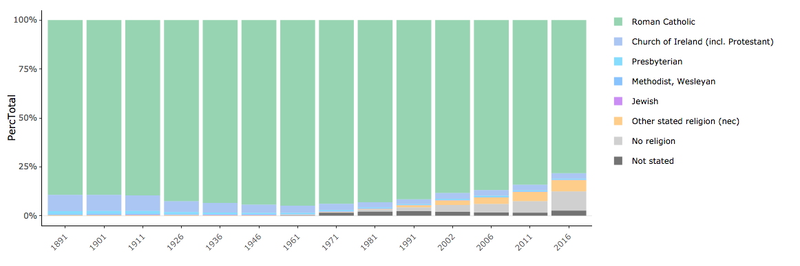
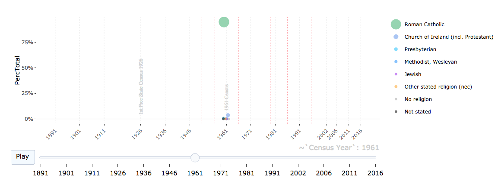
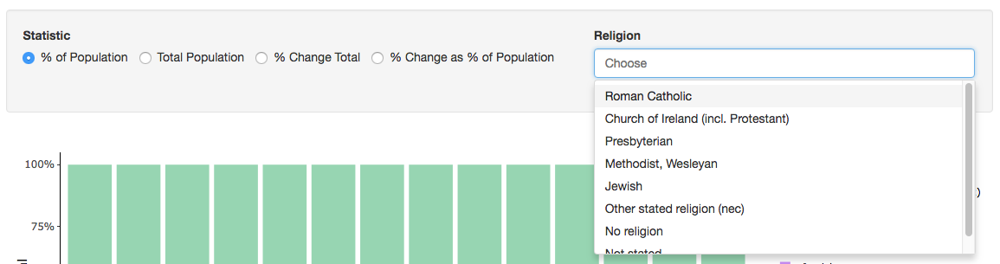

<style>
.section .reveal .state-background {
    background-color: orange;}
.reveal pre code {
    font-size: .9em;
    }
</style>

Religion in Ireland 1891-2016
========================================================
author: Petra Stone
date: 18th Oct 2018
autosize: true
class: intro

1. Intro
========================================================
type: intro

The <a href="https://www.cso.ie/en/" target="_blank">Central Statistics Office</a> (CSO) in the Republic of Ireland publishes records for Censuses of population carried out in Ireland via its <a href="https://www.cso.ie/webserviceclient/" target="_blank">StatBank API</a> as part of an <a href="https://en.wikipedia.org/wiki/Open_data" target="_blank">Open Data</a> initiative. This <a href="https://www.cso.ie/webserviceclient/DatasetDetails.aspx?id=EY037" target="_blank">dataset (EY037)</a> describes religious demographics from 1891 to 2016 for most of the Island of Ireland (the 26 counties of Republic of Ireland).

The app features visualisations of the change in religious composition of the Irish population over a century.

2. Data Summary
========================================================

<small>Percentages were calculated in the R code from the raw time series data which was donwloaded using the CSO API.</small> 

<small>[CSO Source Data](https://www.cso.ie/webserviceclient/DatasetDetails.aspx?id=EY037)</small>


```
  Census Year                                   Religion 
 Min.   :1891   Roman Catholic                      :14  
 1st Qu.:1926   Church of Ireland (incl. Protestant):14  
 Median :1966   Presbyterian                        :14  
 Mean   :1961   Methodist, Wesleyan                 :14  
 3rd Qu.:2002   Jewish                              :14  
 Max.   :2016   Other stated religion (nec)         :14  
                (Other)                             :28  
     Total           PercTotal        PercChangeTotal   
 Min.   :      0   Min.   :0.000000   Min.   :-0.43734  
 1st Qu.:   5186   1st Qu.:0.001411   1st Qu.:-0.07521  
 Median :  19768   Median :0.005376   Median : 0.00000  
 Mean   : 437488   Mean   :0.125000   Mean   : 0.24228  
 3rd Qu.: 127144   3rd Qu.:0.032711   3rd Qu.: 0.09775  
 Max.   :3861335   Max.   :0.948598   Max.   : 7.29298  
                                                        
   PercChange      
 Min.   :-0.48006  
 1st Qu.:-0.09947  
 Median : 0.00000  
 Mean   : 0.19820  
 3rd Qu.: 0.04561  
 Max.   : 6.84771  
                   
```

3. Visualisations
========================================================

There are 2 plots:

Bar graph of population distribution


Animated Bubble Graph of time series



Click the play button to view the animation

You can also view the data in tabular format underneath the plots.

4. Filters
========================================================

You can use filters to select classifications and statistics of interest.
The plots and tables will change dynamically when you filter.




5. Visit the app online
========================================================

- You can view the interactive Shiny app [here (Shinyapps.io)](https://petrastone.shinyapps.io/religionireland/)
- The source code for the shiny app is [here (GitHub)](https://github.com/petrastone/developingdataproducts/tree/master/shinyapp/dataproductsassignment)
- The source code for this presentation [here (GitHub)](https://github.com/petrastone/developingdataproducts/tree/master/shinyapp/dataproductsassignment)
